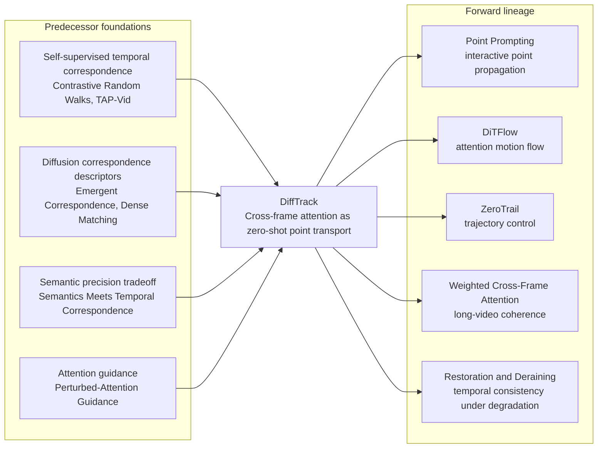

<div align="center">
<h1>

 Emergent Temporal Correspondences from Video Diffusion Transformers</h1>

[**Jisu Nam**](https://scholar.google.com/citations?hl=&user=xakYe8MAAAAJ)<sup>*1</sup>, [**Soowon Son**](https://scholar.google.com/citations?hl=&user=Eo87mRsAAAAJ)<sup>*1</sup>, [**Dahyun Chung**](https://scholar.google.com/citations?hl=&user=EU52riMAAAAJ)<sup>2</sup>, [**Jiyoung Kim**](https://scholar.google.co.kr/citations?hl=&user=DqG-ybIAAAAJ)<sup>1</sup>, [**Siyoon Jin**](https://scholar.google.com/citations?hl=&user=rXRHxkwAAAAJ)<sup>1</sup>, [**Junhwa Hur**](https://scholar.google.com/citations?hl=&user=z4dNJdkAAAAJ)<sup>&dagger;3</sup>, [**Seungryong Kim**](https://scholar.google.com/citations?hl=&user=cIK1hS8AAAAJ)<sup>&dagger;1</sup>

<sup>1</sup>KAIST AI&emsp;&emsp;&emsp;&emsp;<sup>2</sup>Korea University&emsp;&emsp;&emsp;&emsp;<sup>3</sup>Google DeepMind


<sup>*</sup> Equal contribution. <sup>&dagger;</sup>Co-corresponding author.

<h3>NeurIPS 2025</h3>

<a href="https://arxiv.org/abs/2506.17220"></a>
<a href="https://cvlab-kaist.github.io/DiffTrack/"></a>

</div>

### 🔍 How do Video Diffusion Transformers (Video DiTs) learn and represent temporal correspondences across frames?

To address this fundamental question, we present 

**DiffTrack** - a unified framework for uncovering and exploiting emergent temporal correspondences in video diffusion models. DiffTrack introduces:

**📊 Novel Evaluation Metrics** specifically designed to quantify temporal correspondence in video DiTs.

**🚀 Two Practical Applications**
- [**Zero-shot Point Tracking**](#2-zero-shot-point-tracking)  achieving state-of-the-art (SOTA) performance.
- [**Motion-Enhanced Video Generation**](#3-cross-attention-guidance-cag) via a novel Cross-Attention Guidance (CAG) technique.


## Installation

```bash
git clone https://github.com/cvlab-kaist//DiffTrack.git
cd DiffTrack

conda create -n difftrack python=3.10 -y
conda activate difftrack
pip install -r requirements.txt

cd diffusers
pip install -e .
```
</br>

# 1. Correspondence Analysis in Video DiTs

### Analysis on Generated Videos
We provide correspondence analysis across several video backbone models: CogVideoX-2B, CogVideoX-5B, HunyuanVideo, CogVideoX-2B-I2V, and CogVideoX-5B-I2V.

Additional analysis scripts are available in the `scripts/analysis` directory. 

```bash
model=cogvideox_t2v_2b
scene=fg
python analyze_generation.py \
    --output_dir ./output \
    --model $model --video_mode $scene --num_inference_steps 50 \
    --matching_accuracy --conf_attn_score \
    --vis_timesteps 49 --vis_layers 17 \
    --vis_attn_map --pos_h 16 24 --pos_w 16 36 --vis_track \
    --txt_path ./dataset/$model/$scene/prompt.txt \
    --track_dir ./dataset/$model/$scene/tracks \
    --visibility_dir ./dataset/$model/$scene/visibility \
    --device cuda:0
```

#### Key Options

- `--model`: Supported models include `cogvideox_t2v_2b`, `cogvideox_t2v_5b`, `cogvideox_i2v_2b`, `cogvideox_i2v_5b`, `hunyuan_t2v`.
- `--video_mode`: Set to `fg` for object-centric or `bg` for scenic videos.
- `--matching_accuracy`: Computes matching accuracy using both query-key and intermediate features.
- `--conf_attn_score`: Computes confidence score and attention score.
- `--vis_attn_map`: Aggregates cost maps for attention visualization.
- `--vis_track`: Visualizes trajectory using query-key descriptors.


*This script should reproduce videos in the `sample` directory.*

</br>

### Analysis on Real Videos (TAP-Vid-DAVIS)
We provide correspondence analysis across several video backbone models: CogVideoX-2B, CogVideoX-5B. 

Additional analysis scripts are available in the `scripts/analysis` directory. 

```bash
python analyze_real.py \
    --output_dir ./output \
    --model cogvideox_t2v_2b --num_inference_steps 50 \
    --matching_accuracy --confidence_attention_score \
    --resize_h 480 --resize_w 720 \
    --eval_dataset davis_first --tapvid_root /path/to/data \
    --device cuda:0
```
</br>


# 2. Zero-Shot Point Tracking

### Download Evaluation Dataset

```bash
wget https://storage.googleapis.com/dm-tapnet/tapvid_davis.zip
unzip tapvid_davis.zip
```

For TAP-Vid-Kinetics, please refer to the [TAP-Vid GitHub](https://github.com/google-deepmind/tapnet/tree/main/tapnet/tapvid).


### Run Evaluation
We provide across several video backbone models: CogVideoX-2B, CogVideoX-5B, HunyuanVideo.

Additional evaluation scripts are available in the `scripts/point_tracking` directory.

```bash
model=cogvideox_t2v_2b
python evaluate_tapvid.py \
    --model $model \
    --matching_layer 17 --matching_timestep 49 --inverse_step 49 \
    --output_dir ./output \
    --eval_dataset davis_first --tapvid_root /path/to/data \
    --resize_h 480 --resize_w 720 \
    --chunk_frame_interval --average_overlapped_corr \
    --vis_video --tracks_leave_trace 15 \
    --pipe_device cuda:0
```

#### Chunking Options

- `--chunk_len`: Number of frames per chunk. (default: `13`)
- `--chunk_frame_interval`: Interleave frames to reduce temporal gap.
- `--chunk_stride`: Stride for sliding window. (default: `1`)
- `--average_overlapped_corr`: Average overlapping correlation maps.

#### Cost Map Aggregation

- `--matching_layer`: Transformer layers for descriptor extraction. (e.g., `17` for cogvideox_t2v_2b).
- `--matching_timestep`: Denoising timesteps for descriptor extraction. (e.g., `49` for cogvideox_t2v_2b).

#### Dataset Options

- `--tapvid_root`: Path to TAP-Vid dataset.
- `--eval_dataset`: Choose from `davis_first` and `kinetics_first`
- `--resize_h` / `--resize_w`: Resize video resolution.
- `--video_max_len`: Max length of input video.
- `--do_inversion` / `--add_noise`: Modify inversion strategy.

#### Visualization Options

- `--vis_video`: Visualize trajectories on video.
- `--tracks_leave_trace`: Number of frames for trajectory trail.


</br>


# 3. Cross-Attention Guidance (CAG)

We provide across several video backbone models: CogVideoX-2B, CogVideoX-5B.

Additional motion guidance scripts are available in the `scripts/motion_guidance` directory.

```bash
CUDA_VISIBLE_DEVICES=0 python motion_guidance.py \
    --output_dir ./output \
    --model_version 2b \
    --txt_path ./dataset/cag_prompts.txt \
    --pag_layers 13 17 21 \
    --pag_scale 1 \ 
    --cfg_scale 6
```
#### Key Options
- `--model_version`: Supported cogvideox models include `2b`, `5b`.
- `--pag_layers`: Layers where CAG is applied (e.g., `[13, 17, 21]` for 2B, `[15, 17, 18]` for 5B).
- `--pag_scale`: Cross attention guidance scale (default: `1.0`).
- `--cfg_scale`: Classifier-Free Guidance scale (default: `6.0`).


---

## CV Final Project — Experiment Results (Sohum Damani)

This fork reproduces and extends DiffTrack on TAP-Vid-DAVIS using CogVideoX-2B.

### Result Logs & Metrics
All experiment metric logs (`log.txt` per run) are committed in `results/`. delta_avg = % of tracked points within distance threshold (higher = better).

**Timestep convention**: Code's `--matching_timestep` is a 0-indexed denoising step; `ts=49` = paper's `t=1` (near-clean, optimal). `ts=1` = paper's `t=50` (near-pure noise).

#### Layer and Timestep Ablation (l=17, CogVideoX-2B, TAP-Vid DAVIS)

| Config | Mean delta_avg | Notes |
|---|---|---|
| layer=17, ts=30 | 47.8 | In plateau zone with ts=49 — 0.8pt difference within small-sample noise (paper Fig 4c) |
| layer=17, ts=49 | 47.0 | Paper's recommended config (l=17, t=1); paper reports 46.3 on full DAVIS |
| layer=17, ts=49, no-chunk | 46.4 | No chunked sliding window; marginal regression |
| layer=17, ts=20 | 33.4 | Degraded at moderate noise |
| layer=17, ts=10 | 13.1 | High noise — severe degradation (paper Fig 4c) |
| layer=17, ts=5 | 0.8 | Near-noise — near-collapse (paper Fig 4c) |
| layer=17, ts=1 | 0.0 | Near-pure noise — complete failure (paper Fig 4c, t≈50) |

#### Layer Ablation (ts=49 = paper's t=1)

| Config | Mean delta_avg | Notes |
|---|---|---|
| layer=5, ts=49 | 31.3 | Shallow layer — less semantic correspondence |
| layer=8, ts=49 | 41.9 | Positional bias due to RoPE (paper Fig 6) |
| layer=17, ts=49 | 47.0 | Optimal layer (paper Table 1, Fig A.18) |
| layer=27, ts=49 | 37.0 | Over-deep layer — degraded |
| layer=29, ts=49 | 38.0 | Bottom-3 layer, diffuse attention (paper Fig A.18) |

### Video Visualizations
Tracking visualizations (~111 MP4 files, ~6.5 GB) are hosted on Google Drive:

**[View Result Videos on Google Drive](https://drive.google.com/drive/folders/1XM9ZF2WiHAUeXJieYLo7NUz8q9MpGAOv?usp=sharing)**

Videos are organized by experiment: `param_study/`, `limitations/`, `new_experiments/`, `full_eval_davis/`, and `cag_demo/`.

---

## Research Lineage

DiffTrack is best understood as a **research bridge**, not a flat bibliography. The key lineage is:

| Conceptual inputs | DiffTrack contribution | Successor directions |
|---|---|---|
| Self-supervised temporal correspondence | Cross-frame attention becomes a zero-shot matching operator | Point prompting and counterfactual tracking |
| Diffusion features as geometric descriptors | Video DiT representations are probed without tracker training | DiTFlow and attention-derived motion flow |
| Semantic correspondence and layer sensitivity | Layer/timestep choices become probes of where correspondence lives | ZeroTrail, weighted cross-frame attention, restoration, and deraining |

At a graduate level, the important point is that DiffTrack does **not** merely apply a pretrained model to tracking. It reinterprets cross-frame attention inside a video diffusion transformer as a **transport operator over visual evidence**. That operator moves point identity, motion cues, and temporal correspondence through the denoising process without supervised point-tracker labels.



### What DiffTrack Inherits

<details open>
<summary><strong>Representation geometry: why a generative model can be used for correspondence</strong></summary>

This thread answers the first question a reader should ask: **why should a video generator know anything about point tracking?** The answer comes from diffusion correspondence work. **Emergent Correspondence from Image Diffusion (Tang et al., NeurIPS 2023)** shows that diffusion features are not arbitrary generation features; they organize visual parts in a way that can reveal geometric alignment before any explicit tracker is trained.

DiffTrack takes that image-level observation and asks a stricter video question: if diffusion features contain correspondence in still images, can a video diffusion transformer expose **temporal** correspondence across frames? **Diffusion Model for Dense Matching (Nam et al., 2023)** and **Unsupervised Semantic Correspondence via Stable Diffusion (Hedlin et al., NeurIPS 2023)** make this leap more plausible because they show that diffusion representations can behave like dense matching descriptors through query-key similarity and attention-score analysis.

For this project, that inheritance explains why we evaluate layer and timestep at all. We are not just tuning a black-box model; we are probing where geometric correspondence is stored inside the Video DiT.

</details>

<details open>
<summary><strong>Temporal discipline: why a match must survive more than one frame pair</strong></summary>

This thread answers a different question: **what counts as a real temporal match?** A point match is weak if it only looks correct between two nearby frames. **Space-Time Correspondence as Contrastive Random Walk (Jabri et al., NeurIPS 2020)** supplies the deeper criterion: correspondence should remain coherent when propagated through time.

That is why **TAP-Vid, CoTracker, CoTracker3, and Particle Video Revisited** matter in the lineage. They shift the task from "can the model find a visually similar patch?" to "can the model preserve a point identity through occlusion, deformation, camera motion, and appearance change?"

This is also where our limitation results become interpretable. When accuracy drops with frame distance, it is not just a bad metric outcome; it reveals that DiffTrack's attention-based matching is strong locally but lacks the temporal memory that supervised trackers or joint optimization methods are designed to provide.

</details>

<details open>
<summary><strong>Layer and attention theory: why semantics can help identity but hurt precision</strong></summary>

This thread explains why the layer ablation is theoretically meaningful. **Semantics Meets Temporal Correspondence (Qian et al., ICCV 2023)** shows that semantic abstraction can preserve object identity, but the same abstraction can blur exact point location. In point tracking, that tradeoff matters: the model must know what object it is following, but it must also preserve pixel-level geometry.

DiffTrack inherits this tension directly. A shallow layer may preserve local geometry but lack robust semantic structure. A deep layer may know the object but lose the point. The project's layer findings should be read through that lens, not as an isolated leaderboard.

The attention-control side of the lineage adds one more piece. **Self-Rectifying Diffusion Sampling with Perturbed-Attention Guidance (Ahn et al., ECCV 2024)** shows that attention can be manipulated during diffusion sampling, while **CATs** and **Neural Matching Fields** supply broader correspondence machinery around cost aggregation, implicit matching, and confidence. Together, they make DiffTrack's attention analysis feel like part of a larger correspondence tradition rather than a one-off trick.

</details>

### What Later Work Extracts

<details open>
<summary><strong>Prompted tracking: turning an observed signal into an interface</strong></summary>

This successor direction asks: **if DiffTrack can reveal point correspondence, can a user directly steer that correspondence?** **Point Prompting: Counterfactual Tracking with Video Diffusion Models (Shrivastava et al., ICLR 2026)** answers by moving from passive analysis to interaction. It does not merely observe where attention points; it uses prompting to propagate point markers through denoising.

The conceptual move is important. DiffTrack shows that Video DiTs encode motion and point identity. Point prompting extracts that latent structure and turns it into a user-facing control mechanism. In the lineage, this is the moment where "the model contains correspondence" becomes "the model can be asked to use correspondence."

</details>

<details open>
<summary><strong>Motion representation: turning attention maps into a reusable flow field</strong></summary>

This direction asks: **can cross-frame attention become a motion representation, not just a tracking diagnostic?** **DiTFlow: Video Motion Transfer with Diffusion Transformers (Pondaven et al., CVPR 2025)** builds directly on the discovery that cross-frame attention encodes motion. It extracts Attention Motion Flow from attention maps, converting correspondence evidence into a reusable motion field.

This is a stricter successor than a generic related paper. It treats the same attention geometry that DiffTrack uses for tracking as a transport structure for motion transfer. In other words, DiffTrack reads attention to follow points; DiTFlow reads attention to move motion patterns.

</details>

<details open>
<summary><strong>Attention control: turning correspondence into trajectory and identity steering</strong></summary>

This direction asks: **what happens if attention is not only measured, but deliberately controlled?** **ZeroTrail: Zero-Shot Trajectory Control for Video Diffusion Models (Lu et al., NeurIPS Workshop)** extends Cross-Attention Guidance into trajectory control. The mechanism is no longer only diagnostic; it becomes a steering interface for generated motion.

**Enhancing Video Consistency in Zero-Shot T2V via Weighted Cross-Frame Attention (Wang et al., 2025)** follows the same logic for long-video coherence. Instead of asking whether cross-frame attention contains correspondence, it asks how that attention should be weighted so identity persists across time.

This extracts a practical design rule from DiffTrack: if attention carries temporal structure, then changing attention changes temporal behavior.

</details>

<details open>
<summary><strong>Restoration and editing: turning tracking correspondence into a general video prior</strong></summary>

This direction asks: **does correspondence matter even when the task is not tracking?** **Zero-Shot Video Restoration with Video DiMs (Cao et al., 2026)** and **Zero-Shot Video Deraining with Video Diffusion Models (Varanka et al., WACV)** show that it does. They use emergent temporal correspondence to maintain consistency under degradation, shifting the role of correspondence from "follow this point" to "preserve coherent visual evidence across damaged frames."

**Investigating Cross-Attention for Zero-Shot Editing of T2V Models (Motamed et al., CVPR Workshop 2024)** and **VDT: General-Purpose Video Diffusion Transformers via Mask Modeling (Lu et al., 2025)** extend the implication further. Once attention carries temporal structure, it becomes relevant to editing, generation control, and model architecture. DiffTrack's tracking result therefore becomes evidence for a broader claim about how Video DiTs organize time.

</details>

**Takeaway:** before DiffTrack, the central question was whether representations contain correspondence. After DiffTrack, the question becomes how cross-frame attention can be **controlled, weighted, prompted, or extracted** to move visual evidence across time.

---

### Citing this Work
Please use the following bibtex to cite our work:
```
@misc{nam2025emergenttemporalcorrespondencesvideo,
    title={Emergent Temporal Correspondences from Video Diffusion Transformers},
    author={Jisu Nam and Soowon Son and Dahyun Chung and Jiyoung Kim and Siyoon Jin and Junhwa Hur and Seungryong Kim},
    year={2025},
    eprint={2506.17220},
    archivePrefix={arXiv},
    primaryClass={cs.CV},
    url={https://arxiv.org/abs/2506.17220},
}
```
